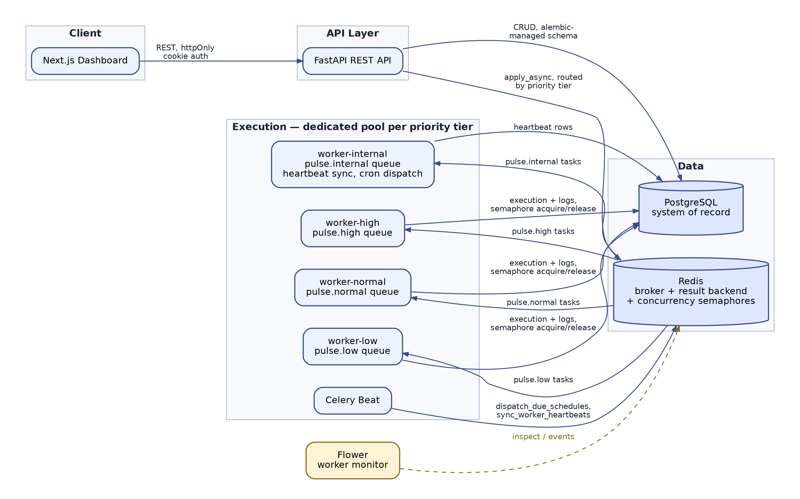

# Pulse

**Distributed Job Scheduling & Orchestration System**

Pulse is a portfolio-grade distributed job scheduling and orchestration system built with **FastAPI, PostgreSQL, Celery, Redis, and Next.js**. It provides one execution pipeline for immediate, delayed, recurring, and dependency-aware jobs, with retries, dead-letter handling, idempotent submission, per-queue concurrency control, priority isolation, execution history, and an operator dashboard.

> **Project status:** engineering prototype / internship portfolio project. The core scheduling and execution path is implemented. Production-hardening items are intentionally documented rather than presented as complete.

## Why Pulse?

A useful job system has to answer more than "was a message placed on a queue?" Pulse is designed around operational questions such as:

- What is the current state of a job?
- Which worker executed each attempt?
- What happened during a retry?
- Why did a job reach the dead-letter queue?
- Can one queue consume all of the concurrency available to the system?
- Can high-priority work remain isolated from a low-priority burst?
- What happens when one job depends on another?
- Can the same submission safely be repeated?
- Can recurring work use the same execution path as a normal job?

## Architecture at a glance



**Execution model:** PostgreSQL is the durable source of truth; Redis carries Celery work and coordination state; the API chooses the priority tier; dedicated worker pools provide real high/normal/low isolation; Beat feeds housekeeping tasks; and recurring schedules create ordinary Pulse jobs before they enter the normal execution pipeline.

For the detailed design, see [Architecture](docs/architecture.md), [Design Decisions](docs/design-decisions.md), and [ER Diagram](docs/er-diagram.md).

## Core capabilities

| Capability | Status | Implementation note |
|---|---|---|
| REST API | ✅ | FastAPI + OpenAPI/Swagger |
| Cookie authentication | ✅ | httpOnly access/refresh cookies |
| Refresh-token rotation | ✅ | Hashed tokens + family-based reuse detection |
| Projects and queues | ✅ | Organization-owned resources |
| Immediate jobs | ✅ | Standard execution path |
| Delayed jobs | ✅ | Celery ETA / `run_at` |
| Recurring jobs | ✅ | 5-field cron evaluated by Beat |
| Retry/backoff | ✅ | Fixed, linear, exponential strategy |
| Dead-letter queue | ✅ | Manual retry supported |
| Idempotency | ✅ | `(queue_id, idempotency_key)` uniqueness |
| Job dependencies | ✅ | Single dependency + recursive failure cascade |
| Queue pause/resume | ✅ | Already-dispatched work is also deferred |
| Per-queue concurrency | ✅ | Redis ownership-aware lease semaphore |
| Priority isolation | ✅ | Dedicated high/normal/low worker pools |
| Execution history | ✅ | Attempt and log records |
| Worker tracking | ✅ | Current claim + execution worker ID |
| Worker heartbeat sync | ✅ | Internal Celery housekeeping task |
| Queue statistics | ✅ | Counts, success rate, latency, throughput, concurrency |
| HTTP job handler | ✅ | SSRF-aware URL validation, timeout and response cap |
| Dashboard | ✅ | Next.js App Router |
| RBAC | Planned | Current model is owner-based |
| Audit log | Planned | Sensitive operator actions are not persisted separately |
| Rate limiting | Planned | API/auth hardening |
| Metrics / tracing | Planned | Prometheus/OpenTelemetry |
| Production deployment hardening | Planned | Current Compose is development-oriented |

## Repository structure

```text
pulse/
├── README.md
├── docker-compose.yml
│
├── backend/
│   ├── Dockerfile
│   ├── requirements.txt
│   ├── alembic.ini
│   ├── alembic/
│   │   └── versions/              # database migrations
│   ├── app/
│   │   ├── main.py                # FastAPI application
│   │   ├── config.py              # environment-backed settings
│   │   ├── database.py             # SQLAlchemy engine/session
│   │   ├── models.py               # database models
│   │   ├── schemas.py              # Pydantic API schemas
│   │   ├── security.py             # password/token helpers
│   │   ├── celery_app.py           # Celery configuration
│   │   ├── dispatch.py             # common job-dispatch path
│   │   ├── tasks.py                # execution/retry/DLQ/cron/heartbeat
│   │   ├── priority.py             # priority → Celery queue mapping
│   │   ├── concurrency.py          # Redis queue semaphore
│   │   ├── worker_registry.py      # worker identity/lifecycle
│   │   ├── url_safety.py           # SSRF protections
│   │   └── routers/                # API route modules
│   └── tests/                      # unit + integration tests
│
├── frontend/
│   ├── app/                        # Next.js routes/pages
│   └── lib/api.ts                  # API client
│
└── docs/
    ├── architecture.md
    ├── design-decisions.md
    ├── er-diagram.md
    ├── Pulse-Technical-Documentation.docx
    └── diagrams/                   # rendered PNGs referenced by the markdown docs above
        ├── architecture.png
        └── er-diagram.png
```

The documentation set is intentionally limited to these four documents under `docs/` (plus the rendered diagram images they reference); the technical documentation is the fifth submission artifact when the root `README.md` is included.

## Quick start — Docker

Docker Compose is the recommended way to run Pulse because the application is intentionally multi-process.

### 1. Start the stack

From the repository root:

```bash
docker compose up --build
```

The stack contains:

- PostgreSQL 16
- Redis 7
- FastAPI API
- one internal Celery worker pool
- high-priority worker pool
- normal-priority worker pool
- low-priority worker pool
- Celery Beat
- Flower
- Next.js dashboard

### 2. Verify the containers

```bash
docker compose ps
```

### 3. Open the services

| Service | URL | Purpose |
|---|---|---|
| Dashboard | `http://localhost:3000` | Operator UI |
| API docs | `http://localhost:8000/docs` | Swagger UI |
| OpenAPI | `http://localhost:8000/openapi.json` | API schema |
| Health | `http://localhost:8000/health` | API process health |
| Flower | `http://localhost:5555` | Celery monitoring |

> The current `/health` endpoint is a process-level health check; it does not perform a full PostgreSQL/Redis readiness check.

### 4. Register a user

```bash
curl -X POST http://localhost:8000/auth/register \
  -H "Content-Type: application/json" \
  -d '{
    "email":"you@example.com",
    "password":"yourpassword123",
    "full_name":"You",
    "organization_name":"Your Org"
  }'
```

### 5. Log in

The login route uses `OAuth2PasswordRequestForm`, so the request is form-encoded rather than JSON:

```bash
curl -i -c cookies.txt -X POST http://localhost:8000/auth/login \
  -H "Content-Type: application/x-www-form-urlencoded" \
  --data "username=you@example.com&password=yourpassword123"
```

Pulse stores the session in httpOnly cookies. For command-line testing, keep the cookie jar:

```bash
curl -b cookies.txt http://localhost:8000/auth/me
```

### 6. Create a project

```bash
curl -b cookies.txt -X POST http://localhost:8000/projects \
  -H "Content-Type: application/json" \
  -d '{"name":"Demo Project","description":"Pulse smoke test"}'
```

Save the returned project ID as `PROJECT_ID`.

### 7. Create a queue

```bash
curl -b cookies.txt -X POST http://localhost:8000/projects/PROJECT_ID/queues \
  -H "Content-Type: application/json" \
  -d '{"name":"demo","priority":5,"concurrency_limit":2}'
```

Save the returned queue ID as `QUEUE_ID`.

Priority mapping is:

```text
1–3  → pulse.high
4–7  → pulse.normal
8–10 → pulse.low
```

This is **capacity isolation**, not strict global priority ordering.

### 8. Submit a test job

```bash
curl -b cookies.txt -X POST http://localhost:8000/projects/PROJECT_ID/queues/QUEUE_ID/jobs \
  -H "Content-Type: application/json" \
  -d '{
    "name":"smoke-test",
    "payload":{"type":"simulate","duration_seconds":2,"fail_rate":0},
    "max_retries":2
  }'
```

Save the returned job ID as `JOB_ID`, then inspect it:

```bash
curl -b cookies.txt http://localhost:8000/jobs/JOB_ID
```

## Recommended smoke-test sequence

For a complete demonstration, test these features in order:

1. Register and log in.
2. Create a project and queue.
3. Submit a successful simulated job.
4. Submit a guaranteed-failure job and observe retries.
5. Confirm the final dead-letter entry.
6. Manually retry the dead-lettered job.
7. Submit the same idempotency key twice and verify one Job row.
8. Submit high/normal/low priority jobs and inspect the corresponding worker pools.
9. Submit several long-running jobs against a small queue concurrency limit.
10. Create a dependency and verify that the child waits for the parent.
11. Fail the parent and verify dependency failure propagation.
12. Pause a queue and verify dispatched work defers instead of executing.
13. Create a cron schedule and observe Beat-generated Jobs.
14. Use Flower and worker logs to trace execution.

## Retry and DLQ demonstration

Create a guaranteed failure:

```json
{
  "name": "failure-demo",
  "payload": {
    "type": "simulate",
    "duration_seconds": 1,
    "fail_rate": 1.0
  },
  "max_retries": 2
}
```

The expected lifecycle is approximately:

```text
QUEUED → CLAIMED → RUNNING → FAILED
                         ↓
                    retry/backoff
                         ↓
                  CLAIMED → RUNNING
                         ↓
                       ...
                         ↓
                   DEAD_LETTER
```

Inspect the current DLQ:

```bash
curl -b cookies.txt http://localhost:8000/dead-letter-jobs
```

Retry the job:

```bash
curl -b cookies.txt -X POST http://localhost:8000/jobs/JOB_ID/retry
```

`JobExecution` preserves the attempt history; `DeadLetterJob` represents the current DLQ state.

## Development without Docker

Docker is recommended. Local execution requires PostgreSQL and Redis to be available separately and requires the API, workers, Beat, and frontend to run as separate processes.

Backend setup:

```bash
cd backend
python -m venv .venv
# activate .venv
pip install -r requirements.txt
pip install pytest
```

Set environment variables appropriate for your local services, then run:

```bash
alembic upgrade head
uvicorn app.main:app --reload --port 8000
```

Run workers in separate terminals, for example:

```bash
celery -A app.celery_app worker -Q pulse.internal --loglevel=info --concurrency=2 --hostname=worker-internal@%h
celery -A app.celery_app worker -Q pulse.high --loglevel=info --concurrency=4 --hostname=worker-high@%h
celery -A app.celery_app worker -Q pulse.normal --loglevel=info --concurrency=4 --hostname=worker-normal@%h
celery -A app.celery_app worker -Q pulse.low --loglevel=info --concurrency=2 --hostname=worker-low@%h
celery -A app.celery_app beat --loglevel=info
```

## Testing

The repository contains **31 test functions across 8 test modules**, covering retry math, priority mapping, concurrency, dependencies, cookie authentication, security, URL safety, and related integration behavior.

Run:

```bash
cd backend
pytest tests/ -v
```

For a targeted test:

```bash
pytest tests/test_concurrency.py -v
pytest tests/test_priority.py -v
pytest tests/test_dependencies.py -v
pytest tests/test_cookie_auth_integration.py -v
```

Integration tests require the dependencies specified by the project and, where applicable, real PostgreSQL/Redis services. A test that cannot collect because dependencies are absent is an environment/setup failure, not evidence that the application logic passed.

## Security model

Pulse currently provides:

- password hashing
- httpOnly cookie-based access/refresh authentication
- refresh-token hashing at rest
- refresh-token rotation and family-based reuse detection
- explicit CORS origin configuration
- organization-scoped resource authorization
- 404 responses for cross-organization resource access
- SSRF-aware HTTP URL validation
- method, timeout, response-size, and redirect restrictions for HTTP jobs

The HTTP handler is hardened against common private/loopback/link-local targets, but DNS rebinding is a deeper network-level problem. Production deployment should add egress controls or a dedicated proxy.

## Execution semantics

Pulse uses **at-least-once execution semantics**.

With late task acknowledgement, a worker crash can cause Celery to redeliver a task. If an external side effect occurred before the crash, that side effect may happen again.

Therefore:

> `idempotency_key` makes **job submission** idempotent; it does not make arbitrary external side effects exactly-once.

## Current limitations

The following are intentionally outside the current implementation scope:

- role-based access control within an organization
- persistent audit log for sensitive operator actions
- API rate limiting
- Prometheus/OpenTelemetry metrics
- correlation IDs and structured JSON logs
- production-grade secrets management
- production Docker hardening and a dedicated production Compose/deployment configuration
- SSE/WebSocket dashboard updates
- multi-parent/fan-in job dependencies
- long-running handler lease renewal
- full dependency-aware readiness checks

These are documented as future hardening rather than implied as complete features.

## Documentation

The submission documentation is intentionally small:

| File | Purpose |
|---|---|
| `README.md` | Project overview, setup, usage, testing, limitations |
| `docs/architecture.md` | System components and execution flow |
| `docs/design-decisions.md` | Important engineering decisions and trade-offs |
| `docs/er-diagram.md` | Current database/entity model |
| `docs/Pulse-Technical-Documentation.docx` | Formal submission document |

## Editing the documentation safely

When the implementation changes, update documentation in this order:

1. **README.md** — change only user-facing behavior, commands, features, and repository structure.
2. **architecture.md** — update components or request/execution flow when service boundaries change.
3. **design-decisions.md** — add or revise a decision only when the implementation introduces a meaningful architectural trade-off.
4. **er-diagram.md** — update whenever models, relationships, fields, or constraints change.
5. **Pulse-Technical-Documentation.docx** — update the formal document last, using the four source documents and the code as the authority.

Do not describe a planned feature as implemented. If a guarantee is conditional, state the condition explicitly.

## License / submission note

This repository is prepared as an internship/portfolio submission. Add a project-specific license only if you intend to publish the source under one.
