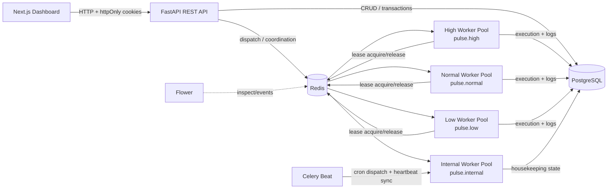

# Pulse — System Architecture

## 1. Purpose

Pulse is a distributed job scheduling and orchestration system. The architecture separates **API/state management**, **message delivery**, **distributed coordination**, and **job execution** so that each responsibility has an appropriate mechanism.

The key design principle is:

> PostgreSQL owns durable application state; Redis/Celery owns task delivery and short-lived coordination; workers perform execution.

## 2. High-level architecture



## 3. Components

### 3.1 Next.js dashboard

The frontend provides the operator-facing interface for authentication, queue/job exploration, queue statistics, and job details.

It communicates with the FastAPI API and relies on browser cookies for authentication rather than storing access tokens in JavaScript-accessible storage.

### 3.2 FastAPI API

The API is the application boundary. It:

- validates requests with Pydantic schemas;
- authenticates users;
- enforces organization ownership;
- creates and updates durable PostgreSQL state;
- maps job priority to a Celery queue;
- dispatches jobs after the durable state required by the worker exists;
- exposes operational and execution data to the dashboard.

Important modules include:

```text
app/main.py
app/routers/*.py
app/dispatch.py
app/schemas.py
app/deps.py
app/security.py
```

### 3.3 PostgreSQL

PostgreSQL is the **system of record** for durable state, including:

- users and refresh-token sessions;
- organizations and projects;
- queues and retry policies;
- schedules;
- jobs;
- execution attempts and logs;
- workers and heartbeats;
- current dead-letter state.

Schema changes are managed through Alembic migrations. The application does not silently create the schema with `create_all()` at startup.

### 3.4 Redis

Redis has two roles:

1. Celery broker/result-backend infrastructure.
2. Backing store for Pulse's custom short-lived coordination primitives.

The custom primitives are:

- per-queue concurrency leases using a sorted set and atomic Lua operations;
- a short-lived cron-dispatch mutex.

### 3.5 Celery worker pools

There are four worker pools in Compose:

| Pool | Queue | Purpose |
|---|---|---|
| Internal | `pulse.internal` | cron dispatch and heartbeat synchronization |
| High | `pulse.high` | priorities 1–3 |
| Normal | `pulse.normal` | priorities 4–7 |
| Low | `pulse.low` | priorities 8–10 |

The dedicated pools provide **capacity isolation**. A burst of low-priority jobs cannot consume the high-priority worker pool.

This is deliberately not described as strict global priority ordering.

### 3.6 Celery Beat

Beat runs periodic housekeeping tasks. The current system uses it for:

- evaluating active cron schedules and creating ordinary Job rows;
- synchronizing worker heartbeat information.

Recurring schedules therefore reuse the normal job execution pipeline rather than introducing a second execution subsystem.

### 3.7 Flower

Flower is a development/operations aid for observing Celery worker and task activity. It is supplementary to the application's PostgreSQL execution history.

## 4. Job lifecycle

A normal job follows this conceptual path:

```text
Client
  ↓
POST job
  ↓
Validate + authorize
  ↓
Create durable Job row
  ↓
Resolve effective priority
  ↓
Dispatch to pulse.high / pulse.normal / pulse.low
  ↓
Celery worker receives task
  ↓
Acquire queue concurrency lease
  ↓
Check queue pause state
  ↓
CLAIMED → RUNNING
  ↓
Create JobExecution + logs
  ↓
Run handler
  ├── success → COMPLETED
  └── failure → retry/backoff OR DEAD_LETTER
  ↓
Release lease
```

### Why the commit happens before dispatch

Dispatching before the Job row is committed creates a race:

```text
publish Celery task
        ↓
worker queries PostgreSQL
        ↓
Job row is not visible yet
        ↓
worker can skip the job
```

Pulse therefore makes the durable database write available before handing the task to the worker.

## 5. Priority routing

The queue and job priority fields use the range 1–10:

```text
1–3  → pulse.high
4–7  → pulse.normal
8–10 → pulse.low
```

A queue has a default priority. A job can explicitly override it. The effective priority is stored on the Job row so the dispatch layer does not need to re-resolve the queue default later.

The result is **worker-pool isolation**, not a claim that every high-priority job globally executes before every lower-priority job.

## 6. Per-queue concurrency

Celery's `--concurrency` controls parallelism within a worker process. It does not enforce a logical limit across all workers serving a Pulse queue.

Pulse therefore uses Redis leases:

```text
pulse:concurrency:{queue_id}

worker token → expiry timestamp
```

Acquisition and release use atomic Redis/Lua operations. Each execution receives a unique ownership token, so a worker can only release the lease it owns.

If a worker crashes, its lease eventually expires and stops counting against the queue.

The current implementation assumes execution remains within a bounded lease lifetime. Long-running handlers would require lease renewal/extension.

## 7. Retry and dead-letter flow

A failure can produce either:

```text
failure → retry → backoff → worker
```

or, once the Job's retry limit is exhausted:

```text
failure → DEAD_LETTER + DeadLetterJob
```

Retry strategy is selected from the optional `RetryPolicy` attached to the Job. The current retry exhaustion limit is stored on the Job itself as `max_retries`; `RetryPolicy.max_retries` exists in the schema but is not currently used to override the Job value.

This distinction is intentional in the documentation because it reflects the current implementation rather than the earlier planned model.

## 8. Dependency execution

The current model supports one dependency per Job:

```text
A → B → C
```

If B depends on A and A is incomplete, B is stored as `BLOCKED` and is not dispatched.

When A completes, B is released through the normal dispatch path.

If A reaches the dead-letter state, dependents are recursively propagated to dead-letter state so a dependency chain does not remain permanently blocked.

The current API does not support fan-in such as `C waits for A AND B`.

## 9. Scheduling

A `JobSchedule` contains a standard five-field cron expression and a payload template.

Beat periodically evaluates active schedules. When a schedule is due, it creates an ordinary Job and routes that Job through the same priority/retry/execution machinery used for ad-hoc jobs.

A short Redis mutex prevents overlapping cron-dispatch runs from both processing the same due schedule at the same time. The lock is a best-effort overlap guard; it is not a distributed exactly-once scheduling protocol.

## 10. Authentication and tenant isolation

The ownership hierarchy is:

```text
User
  ↓
Organization
  ↓
Project
  ↓
Queue
  ↓
Job / Schedule
```

Resource lookups enforce that hierarchy. A resource belonging to another organization is not returned merely because its ID is known.

Browser authentication uses httpOnly cookies. Refresh tokens are stored as hashes in PostgreSQL and rotated through token families.

## 11. Execution semantics

Pulse provides **at-least-once execution semantics**.

With late acknowledgement, a worker crash can result in task redelivery. If an external side effect occurred before the crash, that side effect can happen again.

Therefore:

- submission idempotency is handled by the `(queue_id, idempotency_key)` constraint;
- exactly-once external side effects are not guaranteed by Pulse;
- handlers interacting with external systems must use their own idempotency strategy where necessary.

## 12. Architecture boundaries

The most important boundaries are:

```text
FastAPI       → durable application state + authorization
PostgreSQL    → durable state/history
Redis/Celery  → task delivery + short-lived coordination
Workers       → actual job execution
Next.js       → operator experience
Flower        → Celery-level observation
```

This keeps the scheduler's domain logic explicit without reimplementing the reliable task-delivery machinery already provided by Celery/Redis.
