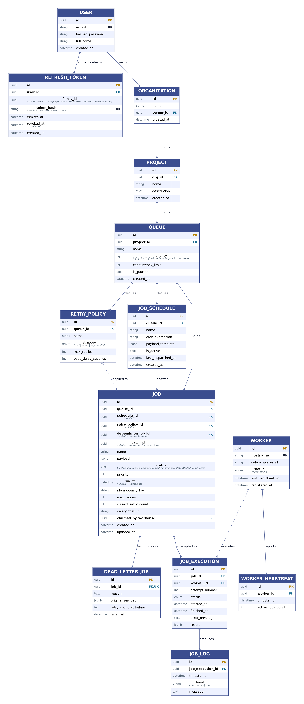

# Pulse — Entity Relationship Diagram

This document focuses on the important keys and relationships so the diagram remains readable on GitHub. For exact column definitions and constraints, `backend/app/models.py` and the Alembic migrations are authoritative.

## Current database model



*14 entities across auth, tenancy, scheduling, and execution. The self-referential `Job.depends_on_job_id` relationship is omitted from the rendered image for visual clarity — see [Dependencies](#dependencies) below.*

## How the model is organized

### Ownership hierarchy

```text
User → Organization → Project → Queue
```

Tenant-owned API resources follow this chain.

### Job state and execution history

```text
Job
 ├── JobExecution × N
 │     └── JobLog × N
 └── DeadLetterJob (0..1 current record)
```

`Job` stores current state. `JobExecution` records attempts. `JobLog` records attempt-level messages. `DeadLetterJob` represents the job's current terminal DLQ state rather than a second execution history.

### Dependencies

`Job.depends_on_job_id` is a nullable self-reference:

```text
Job A → Job B → Job C
```

The current API creates a dependency against an already-existing job. The implemented scope supports **one dependency per job**, not arbitrary DAG/fan-in workflows.

### Retry policies

A Queue can own multiple retry policies and a Job can optionally reference one through `retry_policy_id`. In the current execution path, the selected policy supplies the retry strategy/base delay while `Job.max_retries` controls retry exhaustion.

### Workers

Workers are shared execution infrastructure. A worker can execute many attempts, report heartbeats, and temporarily appear as the current claimant of jobs. Historical execution records remain if a worker is removed; worker foreign keys use `SET NULL` where appropriate.

## Important constraints

- `users.email` is unique.
- Project names are unique within an organization.
- Queue names are unique within a project.
- Worker hostnames are unique.
- Refresh-token hashes are unique.
- A Job has at most one current `DeadLetterJob` row.
- Job submission idempotency is scoped by `(queue_id, idempotency_key)`.
- `(queue_id, status)` is indexed for queue/job filtering.
- Celery task IDs and other operational lookup fields are indexed.

## Updating the diagram

When the database changes, update this diagram **after** updating `backend/app/models.py` and the corresponding Alembic migration. The code and migration history remain the source of truth.
